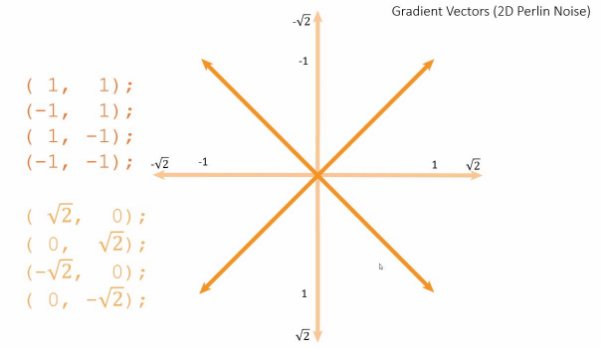

**Jonathan Sebastián Andrade Gordillo**

### Resumen

Mi proyecto final de la asignatura Inteligencia Artificial, consiste en la generación procedural de un mundo haciendo uso de los conocidos mapas de ruido de Perlin, de manera similar a la generación de escenarios del mundialmente conocido juego Minecraft. Estos mapas serán completamente aleatorios cada vez que se ejecute el juego

El mapa, o mejor dicho la altura de los bloques del mapa\* estarán definidos por el mapa de ruido de Perlin, que habrá sido generado previamente usando la algoritmia necesaria.

El entorno será explorable por el jugador de manera libre, aunque no se pretende que se interactúe con él (destruir mover u obtener bloques), por lo que esto serviría como base para un juego estilo minecraft o como una aventura de exploración en sí misma.

### Punto de partida

El punto de partida será un proyecto vacío de unity

No está previsto el uso de plugins o de cualquier otra herramienta de terceros para el desarrollo del proyecto , todo el comportamiento del personaje, generación del mapa de ruido, funcionamiento y creación del mapa la realizaré yo haciendo uso de las herramientas nativas de unity\* y C#

**Controles**

-W: movimiento hacia delante

-A: movimiento hacia la izquierda

-S: movimiento hacia atras

-D: movimiento hacia la derecha

-Barra espaciadora: salto de 1,5 bloques de altura como máximo, la altura de este salto dependerá del tiempo que se mantenga la tecla pulsada

-El control del angulo de la cámara se realizará con el ratón

## Ruido de Perlin

### Historia

El ruido Perlin, fue creado por Ken Perlin(al cual se le debe el nombre) en los años 80. La creación de este algoritmo, nace de la necesidad de crear texturas para la película Tron, ya que por el número de texturas que la película requería, resultaba muy costoso y trabajado el contratar a artistas que las dibujen individualmente. Ken Perlin fue galardonado en el año 1997 con un Óscar por su por su ruido y técnicas de turbulencia de texturas. Su ruido es ampliamente usado hoy en día tanto en cine, videojuegos como sonido.

### Base matemática

La creación de ruido Perlin () se puede descomponer en 4 partes -División en celdas

-Cálculo del producto escalar para cada punto

-Interpolación de los productos escalares

-Suavizado

Cabe recalcar que me centraré en la explicación de la creación de ruido Perlin para la creación de texturas 2D, pero todo es extensible a cuantas dimensiones sean necesarias, y por supuesto aplicable a una sola dimensión.

División en celdas

\*Dependiendo de en cuantas celdas dividas la textura, la imagen tendrá más o menos detalle:

Para conseguir una textura continuada y con cambios uniformes, cada pixel es influenciado por 8 vectores (en caso de 2D), 4 vectores de gradiente, y 4 vectores de distancia:

los vectores de gradiente son elegidos aleatoriamente de una tabla de aleatorios, que deben asegurar que se generen vectores correctamente distribuidos, es decir, que no genere más vectores apuntando hacia un lado que hacia otro, la tabla de uso común para 2D suele contener estos vectores:

los vectores de distancia, son los vectores que van desde las esquinas de la cuadrícula hasta el píxel sobre el que se está trabajando.

Con estos vectores, podemos dar paso al cálculo del producto escalar:

Se calcula el producto escalar para cada esquina haciendo uso de los 8 vectores calculados anteriormente, y con estos 4 productos escalares, se hace una interpolación bilinear:

Se calcula primero mediante interpolación linear el color de los puntos verdes, y luego se hace otra interpolación entre esos dos puntos, lo cual resulta en el color final del pixel

Todo este proceso, da como resultado una textura con este aspecto:

donde se pueden observar numerosos artefactos

este problema es resoluble de varias formas, por ejemplo usando interpolación trigonométrica, aunque en el caso de ruido perlin, se hace uso de una función de suavizado con esta fórmula:

la cual da lugar a una asignación de valores de color más suave y continuada, con forma de S

lo cual es suficiente para eliminar los artefactos de la imagen, resultando en la textura final:

